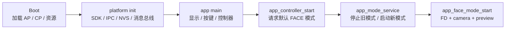
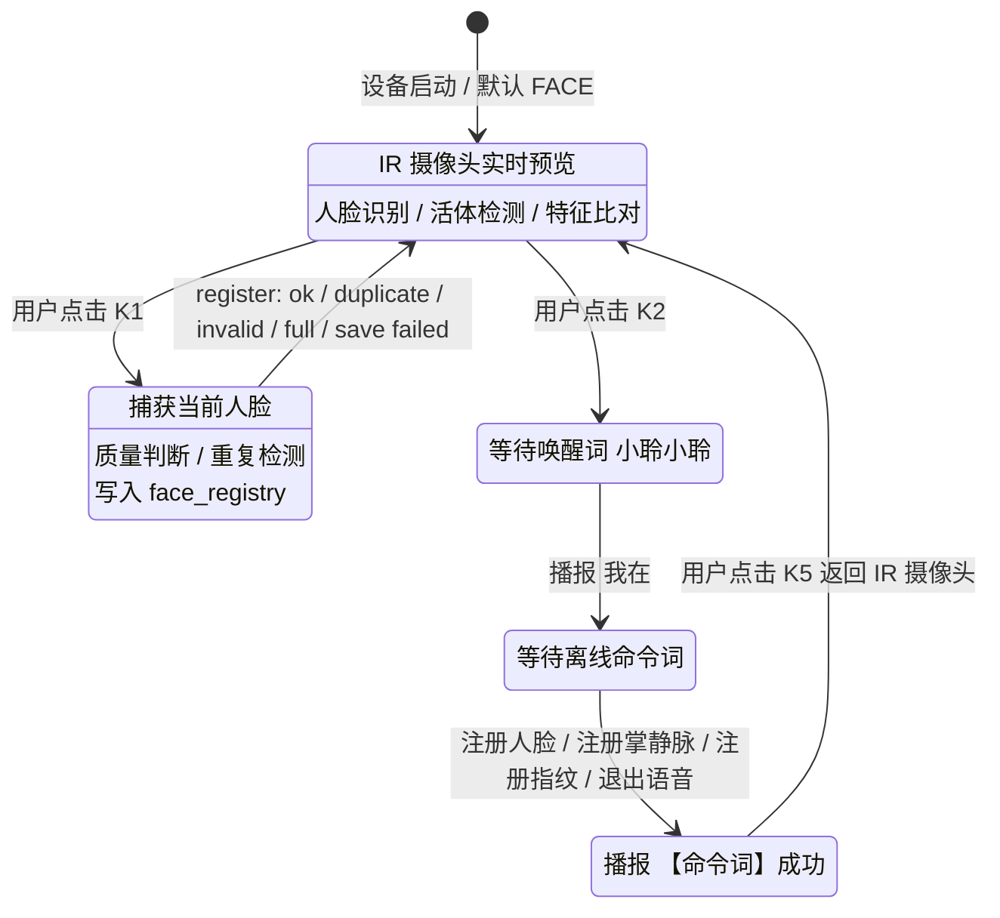
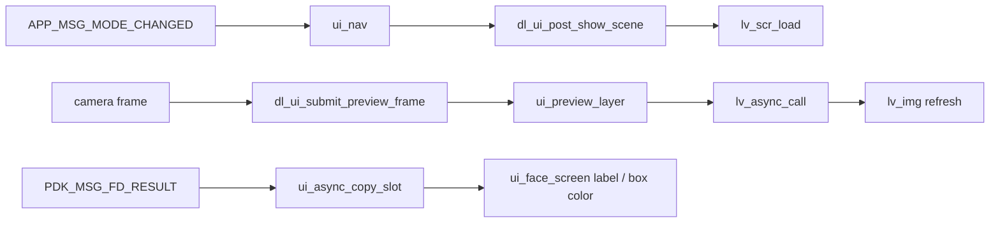
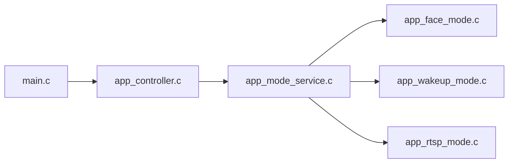
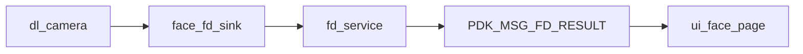
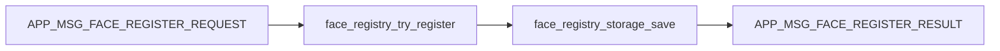
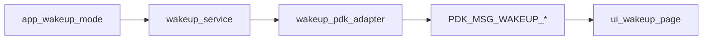
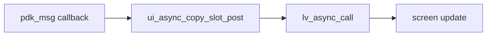
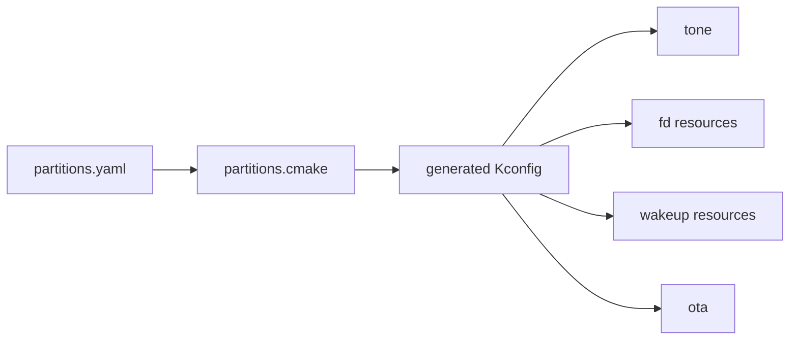

# Smart Door Lock PDK 开发说明

面向 `smart-door-lock` PDK / 应用开发者，覆盖工程定位、构建烧录、运行时架构、消息总线、人脸识别、人脸注册、语音唤醒、UI 接入、低功耗与 OTA 等关键接口。

> HTML 单页版见 [`index.html`](./index.html)。本文在 GitHub 仓库首页提供与 HTML 版一致的核心内容，便于直接阅读、搜索和链接到具体章节。

## Release Snapshot

| 项目 | 内容 |
|---|---|
| 仓库地址 | `https://cloud.listenai.com/CSKG836746/arcs-sdk/public/smart-door-lock.git` |
| PDK 版本 | `smart-door-lock-v0.0.1-alpha.0` |
| 源码描述 | `smart-door-lock-v0.0.1-alpha.0-1-gee398e1c / commit ee398e1c` |
| 面向对象 | 智能门锁二次开发者 |
| 覆盖范围 | PDK 消息总线、模式控制、人脸识别、人脸注册、语音唤醒、LVGL UI、分区资源、OTA、低功耗与构建烧录 |

## 智能门锁 PDK V0.0.1-alpha.0 更新日志

- 新增 Smart Door Lock CP + AP 双核应用方案，CP 侧负责业务逻辑、摄像头、按键、UI 和本地注册数据管理。
- 新增 GC0328 单摄 FD 方案，支持摄像头预览、人脸检测、人脸比对和 LCD 状态显示。
- 新增人脸注册流程，K1 在 FACE 场景下注册当前人脸，并将特征保存到 `face_registry` Flash 分区。
- 新增语音唤醒场景，K2 可切换到 wakeup 模式，支持唤醒词和离线命令词识别链路。
- 新增整包打包流程，支持 boot、AP、CP、FD 模型、wakeup 资源和 tone 统一打包烧录。

## 目录

- [1. 工程定位](#1-工程定位)
- [2. 快速入门](#2-快速入门)
  - [2.1 环境搭建](#21-环境搭建)
  - [2.2 编译构建](#22-编译构建)
  - [2.3 烧录调试](#23-烧录调试)
  - [2.4 分区布局](#24-分区布局)
- [3. 分层架构](#3-分层架构)
  - [3.1 目录结构](#31-目录结构)
  - [3.2 启动链路](#32-启动链路)
  - [3.3 产品应用交互流程](#33-产品应用交互流程)
- [4. PDK 消息总线](#4-pdk-消息总线)
- [5. 模式控制 API](#5-模式控制-api)
- [6. 摄像头与预览](#6-摄像头与预览)
- [7. 人脸识别 FD](#7-人脸识别-fd)
  - [7.1 人脸注册](#71-人脸注册)
- [8. 语音唤醒](#8-语音唤醒)
- [9. UI 接入方式](#9-ui-接入方式)
  - [9.1 LVGL 版本与基础](#91-lvgl-版本与基础)
  - [9.2 当前门锁 UI 界面](#92-当前门锁-ui-界面)
  - [9.3 界面交互流程](#93-界面交互流程)
  - [9.4 UI 二次开发建议](#94-ui-二次开发建议)
- [10. RTSP 预留能力](#10-rtsp-预留能力)
- [11. 系统能力](#11-系统能力)
- [12. 调试排障](#12-调试排障)
- [13. 源码索引](#13-源码索引)

## 1. 工程定位

`smart-door-lock` 是基于 ARCS SDK 的智能门锁产品 PDK 方案。PDK 位于底层 SDK 与具体产品固件之间，负责把人脸算法、摄像头、显示、按键、音频、唤醒、存储、OTA、低功耗等能力封装为可复用的产品级接口。

| 层级 | 职责 |
|---|---|
| `apps/smart-door-lock` | 产品应用：主入口、模式切换、UI 页面、按键策略、人脸注册策略。 |
| `src/framework` | PDK 消息总线与 `pdk_invoke` 异步执行框架。 |
| `src/server` | 算法服务封装：`fd_service`、`wakeup_service`。 |
| `src/middleware` | 播放器、Tone、按键、电源、睡眠、分区、USB、KV、显示等中间件。 |
| `arcs-sdk` | HAL、驱动、RTOS、ACOMP 算法组件、烧录工具和板级支持。 |

核心能力：

- 默认业务：上电进入人脸识别 FACE 场景，摄像头预览、人脸框和识别状态同步显示。
- 人脸注册：FACE 场景按 K1 注册当前人脸，特征写入 Flash 的 `face_registry` 分区。
- 语音唤醒：按 K2 切换到 WAKEUP 场景，通过 ACOMP wakeup 服务发布关键词/命令词结果。
- 资源打包：支持 boot、AP、CP、FD 模型、wakeup 资源和 tone 统一打包为整包镜像。

## 2. 快速入门

### 2.1 环境搭建

Smart Door Lock PDK 仓库地址：`https://cloud.listenai.com/CSKG836746/arcs-sdk/public/smart-door-lock.git`。

先按 ARCS SDK 文档完成工具链、Python、CMake/Ninja、串口权限和 Git LFS 配置。本仓库含算法模型、Tone 和固件资源，克隆前必须安装并启用 `git-lfs`，否则大文件可能只会拉到指针文件，后续编译、打包或烧录会失败。

```bash
sudo apt install git-lfs
git lfs install
git clone https://cloud.listenai.com/CSKG836746/arcs-sdk/public/smart-door-lock.git
cd smart-door-lock
```

### 2.2 编译构建

| 目标 | 命令 | 主要产物 |
|---|---|---|
| 仅编译 CP 固件 | `./build.sh -S ./apps/smart-door-lock -C` | `build/smart-door-lock.bin`、`build/smart-door-lock` |
| 编译并打整包 | `./build.sh -S ./apps/smart-door-lock -DPACK_IMAGES=y -C` | `build/smart-door-lock-all.bin`、`apps/smart-door-lock/res/cp.bin` |

### 2.3 烧录调试

```bash
# 只烧录 CP 固件，CP 分区当前 offset 为 0x800000
./arcs-sdk/tools/burn/cskburn -C arcs -s /dev/ttyACM0 -b 3000000 0x800000 build/smart-door-lock.bin

# 烧录整包镜像，从 0x0 开始写入
./arcs-sdk/tools/burn/cskburn -C arcs -s /dev/ttyACM0 -b 3000000 0x0 build/smart-door-lock-all.bin
```

### 2.4 分区布局

分区单一可信源为 `apps/smart-door-lock/res/partitions.yaml`。构建阶段由 `apps/smart-door-lock/partitions.cmake` 生成 `build/partitions/partitions_auto.conf`。

| 分区 | Offset | Size | 用途 |
|---|---:|---:|---|
| `boot` | `0x000000` | `0x040000` | Bootloader |
| `ap` | `0x040000` | `0x0C0000` | AP 固件，承载算法侧服务 |
| `face_* 模型` | `0x100000` 起 | `0x400000` | FD 检测、对齐、活体、比对模型 |
| `wakeup_algo` / `wakeup_wrap` | `0x4A0000` / `0x600000` | `0x160000` / `0x200000` | 唤醒算法和配置资源 |
| `cp` | `0x800000` | `0x300000` | CP 主业务固件 |
| `tone` | `0xB00000` | `0x100000` | 离线提示音资源 |
| `face_registry` | `0xC00000` | `0x010000` | 人脸注册数据，A/B 槽保存 |

## 3. 分层架构

### 3.1 目录结构

```text
smart-door-lock/
├── apps/smart-door-lock/      # 产品应用：main、app、camera、face、input、ui、wakeup、rtsp
├── src/framework/             # pdk_msg / pdk_invoke
├── src/server/fd/             # fd_service，人脸算法组件封装
├── src/server/wakeup/         # wakeup_service 与 PDK 消息适配
├── src/middleware/            # 通用中间件：audio、tone、button、power、sleep、ota 等
├── modules/                   # ebus、lisaui、lschat、wordseg 等模块
├── arcs-sdk/                  # ARCS SDK 与 ACOMP 组件
└── script/                    # 分区生成、整包打包等脚本
```

### 3.2 启动链路



### 3.3 产品应用交互流程

产品交互按四个连续阶段呈现：默认 IR 摄像头识别、K1 注册人脸、K2 语音命令、K5 返回 IR 摄像头。



阶段说明：

| 阶段 | 用户体验 | UI / 设备反馈 |
|---|---|---|
| 阶段 1：IR 预览识别 | 用户靠近门锁，屏幕显示 IR 摄像头实时画面。 | 显示人脸框、`人脸识别`、`活体检测`、`特征比对` 和最终结果。 |
| 阶段 2：K1 注册人脸 | 用户点击 K1 注册当前人脸。 | 屏幕进入注册流程，展示捕获当前人脸、质量判断、重复检测、写入 `face_registry`，最终显示 `register: ok count=N` 或失败原因。 |
| 阶段 3：K2 语音交互 | 用户点击 K2 进入语音模式，说“小聆小聆”。 | 识别唤醒词后播报“我在”，随后等待离线命令词：注册人脸、注册掌静脉、注册指纹、退出语音。 |
| 阶段 4：K5 返回 IR | 用户再次点击 K5。 | 返回 IR 摄像头显示，恢复实时预览、人脸框和算法状态刷新。 |

## 4. PDK 消息总线

PDK 消息总线由 `src/framework/pdk_msg.h` 提供，使用 `PDK_MSG_ID(domain, evt)` 编码消息 ID，高 16 位为 domain，低 16 位为事件编号。

| 接口 | 说明 | 注意事项 |
|---|---|---|
| `pdk_msg_init()` | 初始化消息总线。 | 平台启动阶段调用。 |
| `pdk_msg_pub(msg_id, data, len)` | 发布消息。 | `data` 生命周期需覆盖同步分发过程。 |
| `pdk_msg_sub(msg_id, cb, user_data)` | 订阅消息。 | 页面/模块创建时订阅，销毁时取消订阅。 |
| `pdk_msg_unsub(msg_id, cb)` | 取消订阅。 | 必须使用同一个回调函数指针。 |
| `pdk_invoke(worker, data, len)` | 投递异步 worker。 | 适合把耗时业务代理到 PDK workq。 |

应用私有消息定义在 `apps/smart-door-lock/src/app/app_events.h`：

| 应用消息 | Payload | 触发者 / 消费者 |
|---|---|---|
| `APP_MSG_MODE_SWITCH_REQUEST` | `app_mode_switch_request_t` | 按键、API 请求 → `app_mode_service` |
| `APP_MSG_MODE_CHANGED` | `app_mode_changed_t` | `app_mode_service` → UI 导航 |
| `APP_MSG_FACE_REGISTER_REQUEST` | 空 | K1 在 FACE 模式下触发 → face mode / UI |
| `APP_MSG_FACE_REGISTER_RESULT` | `app_face_register_result_t` | face mode → UI 注册状态显示 |

## 5. 模式控制 API

模式控制位于 `apps/smart-door-lock/src/app/`，负责在人脸识别、RTSP、语音唤醒之间切换，并保证同一时刻只有一个业务模式处于运行态。

| 接口 / 类型 | 说明 | 文件 |
|---|---|---|
| `app_mode_t` | `APP_MODE_NONE`、`APP_MODE_FACE`、`APP_MODE_RTSP`、`APP_MODE_WAKEUP` | `app_controller.h` |
| `app_controller_init()` | 初始化 controller 及相关服务。 | `app_controller.h` |
| `app_controller_start()` | 启动默认业务，通常进入 FACE 模式。 | `app_controller.h` |
| `app_controller_switch_mode(mode)` | 发布模式切换请求，reason 为 API。 | `app_controller.h` |
| `app_mode_service_init()` | 订阅按键和模式请求消息，执行实际 start/stop。 | `app_mode_service.h` |

按键策略：

| 按键 | 行为 |
|---|---|
| K1 | 非 FACE 场景切换到 FACE；FACE 场景下注册当前人脸。 |
| K2 | 切换到 WAKEUP 场景。 |
| K3 | RTSP 预留；单 GC0328 FD-only 配置下忽略。 |
| K5 | 产品交互中用于从语音流程返回 IR 摄像头显示。 |

## 6. 摄像头与预览

`dl_camera` 是应用层摄像头封装，提供配置、回调注册和启停。FACE 模式默认使用 `DL_CAMERA_PROFILE_FACE_IR`，单 GC0328 摄像头同时输出给 UI 预览和 FD sink。

| 接口 / 类型 | 说明 | 要点 |
|---|---|---|
| `dl_camera_config_t` | 宽高、格式、sensor、xclk、fb_count、镜像翻转、帧间隔等配置。 | 通过 `dl_camera_profile_get()` 获取推荐值。 |
| `dl_camera_frame_t` | 帧数据指针、大小、宽高、格式和 index。 | 回调内不要长期持有 `data` 指针。 |
| `dl_camera_register_cb(cb, user)` | 注册帧消费者，最多 `DL_CAMERA_MAX_CALLBACKS` 个。 | FACE 模式注册 preview 和 FD 两个消费者。 |
| `dl_camera_start/stop()` | 开始/停止采集。 | 切换模式时必须成对处理。 |

## 7. 人脸识别 FD

FD 服务位于 `src/server/fd/fd_service.h`，封装 ACOMP FD 组件的资源准备、启动、输入帧提交、结果转换和已注册特征加载。

| 接口 / 类型 | 说明 | 关键字段 |
|---|---|---|
| `fd_service_config_t` | FD 服务配置。 | `result_cb`、`enable_live_detect`、`live_score_threshold`、`detect_score_threshold` |
| `fd_service_frame_t` | 输入帧。 | `data`、`index`、`length`、`width`、`height`、`format` |
| `fd_service_result_t` | 算法结果。 | `has_face`、`face_rect`、`face_score`、`live_result`、`features`、`compare_scores` |
| `fd_service_load_features(features, count)` | 加载已注册人脸特征。 | 注册成功后通过 pending 标记延迟重载。 |

### 7.1 人脸注册

FACE 模式下按 K1 会发布 `APP_MSG_FACE_REGISTER_REQUEST`。`app_face_mode` 设置 `register_pending`，等待下一次有效 FD 结果；满足质量条件后调用 `face_registry_try_register()` 保存特征并发布 `APP_MSG_FACE_REGISTER_RESULT`。

| 判定项 | 当前条件 | 失败/结果 |
|---|---|---|
| 是否有人脸 | `has_face == true` | `register: no face` |
| 检测分数 | `face_score >= 0.70` | `register: invalid face` |
| 特征数量 | `0 < feature_count <= 384` | `register: invalid face` |
| 活体状态 | `live_result.status == 1` | `register: invalid face` |
| 容量 | `registered_count < 10` | `register: full` |
| 重复判断 | 任一 `compare_scores[i] >= 0.75` | `register: duplicate`，不新增 |
| Flash 写入 | `face_registry_storage_save()` 成功 | `register: save failed` |

## 8. 语音唤醒

当前版本唤醒词和离线命令词默认均为 `小聆小聆`。下一版本将调整为“先唤醒、再命令”的交互：识别唤醒词后播报 `我在`；随后识别离线命令词，并播报 `【命令词】成功`。

| 接口 / 消息 | 说明 | Payload / 行为 |
|---|---|---|
| `wakeup_service_init/start/stop/deinit()` | 唤醒服务生命周期。 | `wakeup_service_config_t`；由 `app_wakeup_mode` 在模式进入/退出时调用。 |
| `wakeup_service_sensitivity_set/get()` | 设置/读取唤醒灵敏度。 | `WAKEUP_SERVICE_SENSITIVITY_LEVEL_0..4` |
| `PDK_MSG_WAKEUP_KEYWORD` | 关键词唤醒结果。 | 当前：`小聆小聆`；下一版本：命中后触发播报 `我在`。 |
| `PDK_MSG_WAKEUP_COMMAND` | 离线命令词识别结果。 | 下一版本命令词：`注册人脸`、`注册掌静脉`、`注册指纹`、`退出语音`。 |
| `PDK_MSG_WAKEUP_RECOGNIZED_START / FINISH` | 识别过程状态。 | UI 可据此展示“聆听中 / 识别结束”，业务层可在 FINISH 后恢复待唤醒。 |

## 9. UI 接入方式

Smart Door Lock UI 基于 LVGL8 构建，应用层以“场景页面”组织界面：FACE 负责摄像头预览、人脸框和注册/比对状态；WAKEUP 负责语音唤醒与命令词状态；RTSP 和 CHAT 为扩展页面。UI 入口位于 `apps/smart-door-lock/src/ui/dl_ui.h`。

### 9.1 LVGL 版本与基础

当前工程启用 `CONFIG_SDK_MODULE_LVGL8=y`，SDK 内置 LVGL 版本为 `8.4.1-dev`（`LVGL_VERSION_MAJOR=8`、`LVGL_VERSION_MINOR=4`、`LVGL_VERSION_PATCH=1`）。显示硬件配置启用 `CONFIG_LISA_DISPLAY_PANEL_ST7789P3`、`CONFIG_LISA_DISPLAY_BUS_SPI_4WIRE` 和 `CONFIG_LISA_DISPLAY_CPDMA_ROTATE`。

| LVGL 概念 | 门锁项目中的用法 | 开发要点 |
|---|---|---|
| `lv_obj_t` | 每个页面创建一个 root screen，例如 `ui_face_screen_t.root`、`ui_wakeup_screen_t.root`。 | 页面销毁时删除 root；root 删除会递归删除子对象。 |
| `lv_label` | FACE 页用于 `Face Detect`、`has_face`、`verify`、`registered`、底部提示；WAKEUP 页用于唤醒结果文本。 | 长文本要设置宽度和 `LV_LABEL_LONG_WRAP`，避免溢出小屏。 |
| `lv_img` | `ui_preview_layer` 使用双缓冲 `lv_img_dsc_t` 显示摄像头帧。 | 摄像头数据需先转换为 RGB565；提交后用 `lv_async_call` 切回 UI 线程更新。 |
| `lv_scr_load` | `dl_ui_show_scene_locked()` 根据当前场景加载对应 root。 | 只在 UI/display lock 保护下切换 screen。 |
| `lv_async_call` | `ui_async_copy_slot` 和 `ui_preview_layer` 用于跨线程 UI 更新。 | PDK 消息回调、摄像头回调不直接操作 LVGL 对象。 |

### 9.2 当前门锁 UI 界面

当前 UI 是轻量级产品验证界面，优先展示算法状态和调试信息。

| 页面 | 源码 | 当前界面内容 | 触发方式 |
|---|---|---|---|
| FACE | `ui_face_screen.c`、`ui_face_page.c` | 摄像头预览、黄色/绿色/红色人脸框、`has_face`、`verify`、`registered/register`、底部按键提示。 | 默认启动进入；K1 从其他场景返回 FACE。 |
| WAKEUP | `ui_wakeup_screen.c`、`ui_wakeup_page.c` | 标题 `Wakeup Mode`、居中的识别结果文本、底部 `K1 FD` 提示。 | K2 切换到唤醒场景。 |
| RTSP | `ui_rtsp_screen.c` | 复用预览层显示摄像头画面，当前 FD-only 配置下默认停用。 | K3 预留；单 GC0328 方案下忽略。 |
| CHAT | `ui_chat_screen.c` | 在线语音 ASR 和云端回复占位文本。 | 当前作为扩展页面保留。 |
| IDLE | `dl_ui_create_blank_screen()` | `Smart Door Lock UI Idle`。 | 无业务场景或 UI 初始化后的空白态。 |

### 9.3 界面交互流程

UI 本身不直接决定业务模式，而是订阅 `APP_MSG_MODE_CHANGED`，由 `ui_nav` 把业务模式映射成 UI 场景，再调用 `dl_ui_post_show_scene()` 切换页面。



| 用户动作 | 业务模式 | UI 页面变化 | 界面反馈 |
|---|---|---|---|
| 设备启动 | `APP_MODE_FACE` | 加载 FACE 页面。 | 实时预览；人脸框；底部提示 `K1 REGISTER | K2 WAKEUP`。 |
| K1（FACE 场景） | 保持 `APP_MODE_FACE` | FACE 页面不切换。 | 注册状态从 `registering...` 变为 `register: ok` / duplicate / invalid 等。 |
| K2 | `APP_MODE_WAKEUP` | 切换到 WAKEUP 页面。 | 显示 `Waiting for wake word...`；收到唤醒/命令消息后更新文本。 |
| K1（WAKEUP 场景） | `APP_MODE_FACE` | 回到 FACE 页面。 | 重新打开预览层，清空上一轮人脸框和状态。 |
| K3 | `APP_MODE_RTSP` 预留 | 如果启用 RTSP，则切换 RTSP 页面。 | 当前 FD-only 配置下 K3 被忽略。 |

### 9.4 UI 二次开发建议

| 建议 | 原因 | 示例 |
|---|---|---|
| 页面结构分层 | 保持 LVGL 对象生命周期和业务订阅解耦。 | `ui_face_screen.c` 创建控件，`ui_face_page.c` 订阅 PDK 消息。 |
| 避免回调直改 UI | PDK、摄像头、算法回调不保证在 LVGL 线程。 | 使用 `ui_async_copy_slot_post()` 或 `lv_async_call()`。 |
| 小屏优先信息层级 | 门锁屏幕空间有限，状态文本过多会遮挡预览。 | FACE 页保留标题、识别状态、注册状态和底部提示，详情日志放串口。 |
| 颜色语义固定 | 降低用户理解成本。 | 黄色=未注册/等待，绿色=成功/通过，红色=失败/不匹配。 |
| 新增语音页状态机 | 下一版本命令词流程需要明确阶段反馈。 | Waiting wake word → 我在 → 等待命令词 → 命令成功播报。 |
| 资源和字体谨慎扩展 | Flash/PSRAM 和刷新带宽有限。 | 图标、字体、背景图优先打包到资源分区并按需加载。 |

二次开发入口：

| 任务 | 建议入口 |
|---|---|
| 新增页面 | `apps/smart-door-lock/src/ui/your_page/`，沿用 `*_screen.c` + `*_page.c` 分层。 |
| 新增场景 | 扩展 `dl_ui_scene_t`，在 `dl_ui.c` 补充 create/show/hide/root 映射，在 `ui_nav.c` 绑定业务模式。 |
| 刷新业务数据 | 使用 `ui_async_copy_slot_post()`，PDK 回调里只复制 payload。 |
| 刷新视频预览 | 复用 `ui_preview_layer_set_frame()` 的双缓冲和格式转换。 |

线程安全原则：LVGL 对象只能在 LVGL 线程访问。PDK 消息回调中只复制数据、投递 async，不要直接创建、删除或修改 `lv_obj_t`。

## 10. RTSP 预留能力

RTSP 相关代码位于 `apps/smart-door-lock/src/rtsp/`，当前单 GC0328 FD-only 配置下默认暂停/忽略 K3 RTSP 切换。

| 接口 | 说明 | 备注 |
|---|---|---|
| `app_rtsp_configure/start/stop()` | 设置并控制 RTSP。 | 由 `app_rtsp_mode` 管理。 |
| `app_rtsp_send_frame()` | 送入一帧视频。 | 可结合 JPEG 编码。 |
| `jpeg_encoder_init/encode/stop()` | 硬件 JPEG 编码封装。 | 复用输出缓冲区可减少重复初始化成本。 |
| `rtsp_audio_source_*` | 16 kHz 单声道 PCM 音频源。 | 可转换为 L16 big-endian。 |

## 11. 系统能力

| 模块 | 接口 | 说明 |
|---|---|---|
| Power | `power_init()`、`power_wait_settle()`、`power_shutdown()` | 电源锁存、长按开机判定、关机回调。 |
| Sleep | `sleep_enable_wakeup_gpio()`、`sleep_enter()`、`sleep_get_wakeup_cause()` | 配置 PMU 唤醒源，进入低功耗。 |
| Battery | `get_battery_voltage_percentage()`、`get_battery_status()`、`get_usb_status()` | 电池电量、充电状态、USB 插拔检测。 |
| OTA | `app_ota_start_tf()`、`app_ota_start_flash()` | 封装 U-Boot OTA 请求、校验和启动升级。 |
| Tone | `app_tone_default_init()`、`app_tone_get_url()` | 离线提示音资源加载和 URL 查询。 |

## 12. 调试排障

| 现象 | 优先检查 | 建议处理 |
|---|---|---|
| 编译找不到算法资源地址 | `build/partitions/partitions_auto.conf` 是否生成 | 检查 `res/partitions.yaml` 字段和 `PACK_IMAGES` 流程。 |
| 烧录后无 FD 结果 | AP 固件、FD 模型分区、`CONFIG_ACOMP_FD` | 首烧用整包；确认 FD 资源存在。 |
| K1 无法注册 | 是否处于 FACE 模式、是否有人脸、活体/分数阈值 | 观察 UI 文本：`no face`、`invalid face`、`duplicate` 等。 |
| 切到 wakeup 无反应 | `CONFIG_ACOMP_WAKEUP`、wakeup 资源地址、麦克风链路 | 确认 K2 发布模式切换，订阅 `PDK_MSG_WAKEUP_*` 日志。 |
| UI 偶发崩溃 | 是否在非 LVGL 线程操作 `lv_obj_t` | 改用 `dl_ui_post_show_scene()`、`ui_async_copy_slot_post()` 或 `lv_async_call()`。 |

## 13. 源码索引

源码索引按功能链路组织。开发时可先从业务入口定位到功能链路，再沿箭头找到对应实现文件；每张地图卡片提供核心路径、上下游关系、典型修改点和排查入口。

### 13.1 启动与模式调度地图



| 文件 | 职责 | 常见修改点 |
|---|---|---|
| `apps/smart-door-lock/src/main.c` | 应用入口，串联显示、输入、控制器等初始化。 | 新增全局服务初始化、调整启动顺序。 |
| `apps/smart-door-lock/src/app/app_controller.h/.c` | 提供 `app_controller_init/start/switch_mode`。 | 修改默认模式、开放新的模式切换 API。 |
| `apps/smart-door-lock/src/app/app_mode_service.c` | 实际执行模式 stop/start，处理 K1/K2/K3 策略。 | K1 注册逻辑、K2 唤醒切换、RTSP 禁用策略。 |
| `apps/smart-door-lock/src/app/app_events.h` | 应用私有消息定义。 | 新增业务消息或扩展 payload。 |

### 13.2 人脸识别链路地图



- `apps/smart-door-lock/src/camera/dl_camera.h`：摄像头配置、帧结构、回调注册和启停。
- `apps/smart-door-lock/src/camera/dl_camera_profile.h`：FACE/RTSP 场景的摄像头 profile。
- `apps/smart-door-lock/src/face/face_fd_sink.h`：缓存摄像头帧并提交给 FD，避免阻塞采集回调。
- `src/server/fd/fd_service.h`：ACOMP FD 的服务层封装，输出 `fd_service_result_t`。
- `apps/smart-door-lock/src/ui/face/ui_face_page.c`：订阅 `PDK_MSG_FD_RESULT` 和 `PDK_MSG_FD_NO_FACE`，刷新人脸框和匹配状态。

### 13.3 人脸注册与持久化地图



- `apps/smart-door-lock/src/face/app_face_mode.c`：接收注册请求、等待 FD 结果、发布注册结果。
- `apps/smart-door-lock/src/face/face_registry.h/.c`：注册质量判断、重复判断、容量控制、加载到 FD。
- `apps/smart-door-lock/src/face/face_registry_storage.h/.c`：Flash 中 `face_registry` 分区的 A/B 槽读写。
- `apps/smart-door-lock/res/partitions.yaml`：注册区 offset/size 的唯一可信源。

### 13.4 语音唤醒与命令词地图



- `apps/smart-door-lock/src/wakeup/app_wakeup_mode.h/.c`：进入/退出 WAKEUP 模式时启动或停止唤醒服务。
- `src/server/wakeup/wakeup_service.h`：唤醒服务生命周期、灵敏度、结果回调。
- `src/server/wakeup/wakeup_pdk_adapter.h`：算法结果到 `PDK_MSG_WAKEUP_KEYWORD` / `PDK_MSG_WAKEUP_COMMAND` 的适配层。
- `apps/smart-door-lock/src/ui/wakeup/ui_wakeup_page.c`：订阅唤醒和命令消息，显示“聆听中 / 识别结果”。

### 13.5 UI 与线程切换地图



- `apps/smart-door-lock/src/ui/dl_ui.h/.c`：UI 总入口、场景切换、预览帧提交。
- `apps/smart-door-lock/src/ui/ui_nav.c`：订阅 `APP_MSG_MODE_CHANGED` 并切换 UI 场景。
- `apps/smart-door-lock/src/ui/ui_async.h/.c`：小数据复制 + 异步应用工具。
- `apps/smart-door-lock/src/ui/widgets/ui_preview.h/.c`：预览图像转换、双缓冲和 LVGL image 刷新。

### 13.6 资源、分区、OTA 与系统能力地图



- `apps/smart-door-lock/res/partitions.yaml`：boot/AP/CP/算法/Tone/face_registry 分区定义。
- `apps/smart-door-lock/partitions.cmake`：把分区转成 Kconfig 和打包配置。
- `src/middleware/tone/app_tone.h`：Tone 镜像校验、加载和 tone_id URL 查询。
- `src/system/ota/app_ota.h`：TF / Flash OTA 包校验、请求和启动升级。
- `src/middleware/sleep/sleep_manager.h`、`src/middleware/power/power_manager.h`：低功耗、唤醒源和电源管理。

### 13.7 按现象查代码

| 问题现象 | 优先定位 | 定位依据 |
|---|---|---|
| 开机后没有进入人脸识别 | `main.c`、`app_controller.c`、`app_mode_service.c` | 默认模式请求和实际 start/stop 都在这一链路。 |
| K1 按下没有注册 | `app_mode_service.c`、`app_face_mode.c`、`face_registry.c` | K1 先映射为注册请求，再等待下一帧 FD 结果做质量判断。 |
| 有人脸框但一直不匹配 | `face_registry_load_to_fd()`、`fd_service_result_t.compare_scores`、`ui_face_page.c` | 匹配依赖已注册特征加载和 compare score 阈值。 |
| 切到语音后无响应 | `app_wakeup_mode.c`、`wakeup_service.h`、`wakeup_pdk_adapter` | 需要确认服务启动、资源地址、算法回调和 PDK 消息发布。 |
| UI 页面崩溃或卡住 | `ui_async.c`、`ui_nav.c`、对应 page 文件 | 多数是线程切换或页面销毁后仍收到异步事件。 |
| 打包后资源地址异常 | `partitions.yaml`、`partitions.cmake`、`build/partitions/partitions_auto.conf` | 资源地址由分区表生成，不应多处手写。 |
